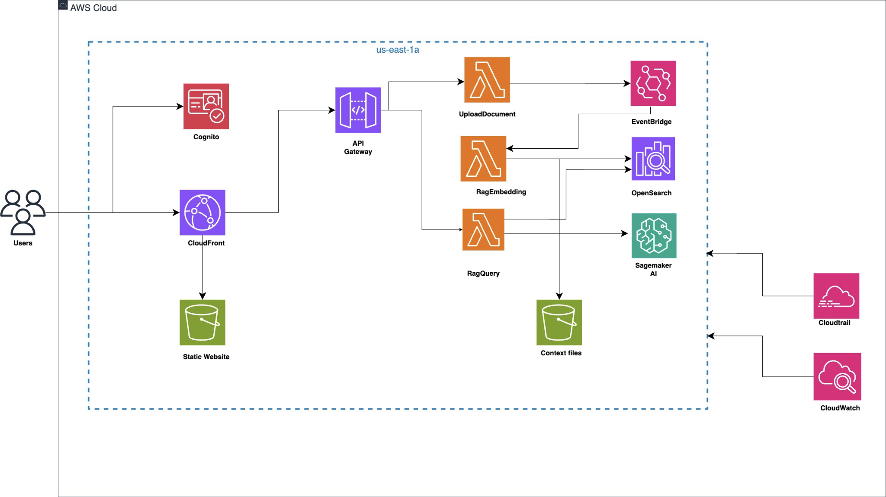

# Virtual Sales Assistant with RAG-Enabled FLAN-T5 on AWS

## Overview

This project implements a virtual sales assistant using Retrieval-Augmented Generation (RAG) architecture on AWS. The solution combines Google's FLAN-T5 Small language model deployed on Amazon SageMaker with a RAG pipeline powered by AWS Lambda and OpenSearch. Through prompt engineering, the system functions as an intelligent sales assistant that can handle product inquiries, provide sales support, and maintain professional sales conversations.

## Architecture



### Architecture Components

#### Core Infrastructure
- **Amazon S3**: Document storage and static website hosting
- **Amazon SageMaker**: Hosts the FLAN-T5 Small model endpoint
- **Amazon OpenSearch**: Vector database for document indexing and search
- **AWS Lambda**: Serverless compute for RAG processing and API endpoints
- **Amazon API Gateway**: RESTful API endpoints for frontend integration
- **AWS CloudFormation**: Infrastructure as Code for deployment

#### Data Flow
1. **Document Upload**: Sales documents uploaded to S3 trigger Lambda processing
2. **Vectorization**: Documents are chunked, embedded, and indexed in OpenSearch
3. **Query Processing**: Customer queries trigger the RAG pipeline via API Gateway
4. **Context Retrieval**: Relevant information retrieved from OpenSearch
5. **Sales Response**: FLAN-T5 generates sales-focused responses using retrieved context
6. **Response Delivery**: Professional sales responses returned via API Gateway

## Features

- **Virtual Sales Assistant**: AI assistant trained for sales conversations through prompt engineering
- **FLAN-T5 Integration**: Language model deployed on SageMaker with Hugging Face
- **RAG Implementation**: Context-aware responses using document retrieval
- **Prompt Engineering**: Custom prompts optimized for sales scenarios
- **Vector Search**: OpenSearch-powered semantic search
- **Serverless Architecture**: Cost-effective Lambda functions
- **Web Interface**: HTML frontend for customer interactions
- **Document Processing**: Automated sales material indexing
- **API Integration**: RESTful APIs for system integration

## Project Structure

```
├── cloudformation/
│   ├── opensearch-rag-pipeline.yaml
│   ├── upload-endpoint-template.yaml
│   ├── rag-query-lambda.yaml
│   ├── s3-bucket.yaml
│   └── sagemaker-flan-t5.yaml
├── frontend/
│   └── index.html
└── README.md
```

## Prerequisites

- AWS CLI configured with appropriate permissions
- AWS account access to required services
- Basic understanding of AWS CloudFormation

## Deployment Instructions

### Step 1: Deploy Infrastructure

Deploy CloudFormation stacks in order:

1. **S3 Bucket**
   ```bash
   aws cloudformation deploy --template-file s3-bucket.yaml \
     --stack-name sales-assistant-s3 \
     --capabilities CAPABILITY_IAM
   ```

2. **OpenSearch and RAG Pipeline**
   ```bash
   aws cloudformation deploy --template-file opensearch-rag-pipeline.yaml \
     --stack-name sales-assistant-search \
     --capabilities CAPABILITY_IAM
   ```

3. **SageMaker Model**
   ```bash
   aws cloudformation deploy --template-file sagemaker-flan-t5.yaml \
     --stack-name sales-assistant-model \
     --capabilities CAPABILITY_IAM
   ```

4. **Upload Endpoint**
   ```bash
   aws cloudformation deploy --template-file upload-endpoint-template.yaml \
     --stack-name sales-assistant-upload \
     --capabilities CAPABILITY_IAM
   ```

5. **Query Lambda**
   ```bash
   aws cloudformation deploy --template-file rag-query-lambda.yaml \
     --stack-name sales-assistant-query \
     --capabilities CAPABILITY_IAM
   ```

### Step 2: Configure Frontend

1. Update API endpoints in `index.html`
2. Upload frontend to S3 bucket
3. Enable static website hosting

### Step 3: Upload Sales Documents

Upload your sales materials using the upload endpoint:
- Product catalogs
- Sales scripts
- Pricing information
- FAQ documents

## Technical Details

### RAG Pipeline

1. **Document Processing**: Sales documents are chunked and processed
2. **Embedding Generation**: Text converted to vector embeddings
3. **Index Storage**: Embeddings stored in OpenSearch
4. **Query Processing**: Customer queries embedded for similarity search
5. **Context Retrieval**: Relevant content retrieved from OpenSearch
6. **Response Generation**: FLAN-T5 generates sales responses with context

### Prompt Engineering

The sales assistant uses specialized prompts for:
- Product inquiries and explanations
- Pricing discussions
- Objection handling
- Professional sales communication
- Customer qualification

### Model Configuration

- **Model**: FLAN-T5 Small from Hugging Face
- **Instance**: ml.t2.medium (configurable)
- **Auto-scaling**: Enabled for cost optimization
- **Endpoint**: RESTful API for inference

## Usage

### Web Interface

The HTML frontend provides:
- Customer chat interface
- Document upload functionality
- Real-time sales assistance

### API Endpoints

- `POST /upload` - Upload sales documents
- `POST /query` - Send queries to sales assistant
- `GET /status` - Check system health

### Sales Use Cases

- Product information requests
- Feature comparisons
- Pricing inquiries
- Technical specifications
- Sales support

## Monitoring

System includes monitoring for:
- Lambda function performance
- SageMaker endpoint metrics
- OpenSearch cluster health
- API Gateway analytics
- Response quality and relevance

## Security

- IAM roles with least privilege
- Data encryption in transit and at rest
- API Gateway throttling
- Secure document storage

## Cost Optimization

- Serverless architecture reduces costs
- Auto-scaling based on demand
- S3 intelligent tiering
- OpenSearch instance optimization

## Troubleshooting

### Common Issues

1. **Slow Response Times**
   - Check SageMaker endpoint performance
   - Monitor Lambda function timeouts
   - Verify OpenSearch query performance

2. **Poor Response Quality**
   - Review sales document completeness
   - Update prompt templates
   - Check retrieval relevance scores

3. **Upload Failures**
   - Verify S3 permissions
   - Check Lambda processing logs
   - Validate document formats

## Contributing

1. Fork the repository
2. Create feature branch
3. Test changes thoroughly
4. Submit pull request

## Acknowledgments

- Google FLAN-T5 model from Hugging Face
- AWS services and documentation
- OpenSearch community